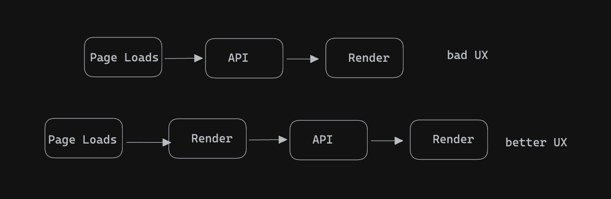

## `<script>` tag placement

The placement of the `<script>` tag within an HTML document can significantly affect the behavior and performance of the web page. Here are some common placements and their implications:

1. **Inside the `<head>` section**: Placing `<script>` tags within the `<head>` section allows scripts to be loaded and executed early in the page's lifecycle. This can be beneficial for scripts that are required to run before the page content is displayed or for scripts that are essential for the page to function properly. However, it can also delay the rendering of the page content if the scripts take a long time to load or execute.

2. **At the end of the `<body>` section**: Placing `<script>` tags at the end of the `<body>` section ensures that they are loaded after the page content has been rendered. This can improve the perceived performance of the page, as users will see the content more quickly. Additionally, it prevents scripts from blocking the rendering of the page. However, scripts placed here may still delay the execution of other scripts or interact with the DOM before it's fully loaded.

3. **Using async or defer attributes**: The `async` and `defer` attributes can be added to `<script>` tags to control how scripts are loaded and executed. 
   - **`async`**: Scripts with the `async` attribute are loaded asynchronously and executed as soon as they are available, without blocking the rendering of the page. However, they may execute out of order, which can lead to unpredictable behavior.
   - **`defer`**: Scripts with the `defer` attribute are also loaded asynchronously, but they are executed in the order they appear in the document, after the document has been parsed but before the `DOMContentLoaded` event is fired. This can be useful for scripts that rely on the DOM being fully loaded.

Overall, the placement of `<script>` tags depends on the specific requirements of the page and the behavior you want to achieve. It's important to consider factors such as page load time, script dependencies, and the impact on user experience when deciding where to place scripts in an HTML document.


## `package.json` and `package-lock.json` 

1. **package.json**:
   - This file is a manifest for the project and is used to manage project metadata and dependencies.
   - It contains information such as the project name, version, description, author, and scripts.
   - One of its main purposes is to list the project's dependencies along with their version ranges. Developers typically add dependencies manually or using npm commands like `npm install package-name --save`.
   - `package.json` is meant to be committed to version control and shared with others working on the project.

2. **package-lock.json**:
   - This file is automatically generated and maintained by npm and serves as a record of the exact versions of dependencies that were installed for the project.
   - It ensures that every developer working on the project installs the exact same versions of dependencies, regardless of differences in their local environment or the order in which dependencies were installed.
   - `package-lock.json` also includes additional metadata such as the resolved URLs of package tarballs and integrity hashes for package contents.
   - It's not intended to be directly edited by developers, and npm manages it automatically when dependencies are installed or updated.

In summary, while `package.json` describes the project and its dependencies at a high level, `package-lock.json` provides a detailed, version-locked snapshot of the dependencies that ensures consistency across different development environments. Both files are crucial for managing dependencies effectively in Node.js projects.


## Caret vs Tilde

1. **Caret (`^`)**:
   - When you specify a version range with the caret (`^`), npm will allow updates to the specified dependency up to the next major version.
   - For example, if you specify `"^1.2.3"`, npm will allow updating to any version within the range `1.x.x`, but it won't update to version `2.0.0` or higher.

2. **Tilde (`~`)**:
   - When you specify a version range with the tilde (`~`), npm will allow updates to the specified dependency up to the next minor version.
   - For example, if you specify `"~1.2.3"`, npm will allow updating to any version within the range `1.2.x`, but it won't update to version `1.3.0` or higher.
  

## Browser scripts vs modules

| Aspect                 | Browser Script                                       | Module                                                |
|------------------------|------------------------------------------------------|-------------------------------------------------------|
| Scope                  | Operates within the global scope of the browser window. | Introduces encapsulation, scoped within the module.   |
| Dependency Management  | Manual, scripts need to be included in a specific order in HTML. | Supports explicit dependency declaration using `import` statements. |
| Encapsulation          | Lacks encapsulation, leading to potential conflicts between scripts. | Provides encapsulation, variables and functions are scoped within the module. |
| Execution              | Synchronously loaded and executed, potentially blocking page rendering. | Asynchronously loaded, allowing page rendering to continue while fetching modules. |
| Benefits               | Easy to get started with, suitable for small projects. | Promotes code organization, modularity, and better dependency management. |


## Bundler

A bundler is a tool used in web development to combine multiple separate files or modules into a single file (or multiple files) in a format optimized for deployment (the process is called Bundling). Bundlers are commonly used for JavaScript applications, but they can also bundle other types of assets such as CSS, images, and fonts.

The main purposes of bundlers are:

1. **Dependency Management**: Bundlers handle dependencies between different modules or files in a project. They analyze the dependency graph and ensure that modules are bundled in the correct order to satisfy dependencies.

2. **Code Transformation**: Bundlers often include tools for transforming code using preprocessors or transpilers. For example, they can convert modern JavaScript syntax (such as ES6+) into a format compatible with older browsers.

3. **Optimization**: Bundlers can optimize the bundled output by removing dead code, minifying JavaScript and CSS, and other techniques to reduce file sizes and improve loading times.

4. **Code Splitting**: Advanced bundlers support code splitting, a technique that breaks the codebase into smaller chunks and loads them dynamically as needed. This can improve the initial loading time of the application by only loading the code required for the current page or feature.

Some popular bundlers in the JavaScript ecosystem include webpack, Parcel, and Rollup. By bundling assets together, developers can simplify deployment and improve performance by reducing the number of HTTP requests needed to load a web page. Bundling also aids in managing complex codebases more efficiently, particularly in large-scale projects where there are numerous dependencies and files to manage.

### Parcel
    - Dev build (different dev and prod build)
    - Local server
    - HMR
    - File watching algorithm - written in c++
    - cache - faster build
    - image optimization
    - minification
    - bundling
    - compress
    - consistent hashing
    - code splitting
    - differntial building - to support older browser versions
    - diagnostic 
    - error handling 
    - HTTPS support 
    - Tree shaking - remove unused code

## HMR
HMR stands for Hot Module Replacement. It's a feature commonly used in development environments, especially in web development with frameworks like React, Vue.js, and webpack.

HMR allows developers to make changes to their code (such as JavaScript, CSS, or even HTML) while the application is running, and see those changes instantly reflected in the browser without needing to refresh the page. 

Here's how it typically works:

1. **Detection of Changes**: The development server monitors the project files for changes. When a change is detected, the server initiates the HMR process.

2. **Replacement of Modules**: Instead of reloading the entire application, HMR only updates the modules that have changed. It swaps out the old version of the module with the new one, preserving the application's state as much as possible.

3. **Application Update**: Once the modules are replaced, the application re-renders with the updated code. Any changes made by the developer become immediately visible in the browser, providing a faster feedback loop during development.

HMR significantly speeds up the development process by eliminating the need for manual page refreshes after making code changes. It helps developers maintain their focus and productivity by reducing the turnaround time for seeing the effects of their modifications.


## Consistent hashing
Consistent hashing is a hashing technique used in distributed systems to efficiently distribute and manage data across multiple nodes or servers while minimizing the impact of adding or removing nodes.

In traditional hashing, data is distributed among a fixed number of buckets based on the hash value of the data. However, when nodes are added or removed from the system, a significant portion of the data may need to be rehashed and redistributed, which can be computationally expensive and lead to a lot of data movement.

Consistent hashing addresses this issue by introducing the concept of virtual nodes and a ring-based hash space. Here's how it works:

1. **Hash Space**: Consistent hashing uses a hash function to map keys or data to a continuous hash space, typically represented as a ring.

2. **Virtual Nodes**: Each physical node in the system is associated with multiple virtual nodes distributed evenly around the hash ring. The more virtual nodes a physical node has, the more evenly distributed the data will be.

3. **Data Mapping**: When data needs to be stored or retrieved, it is hashed to determine its position on the hash ring. The data is then assigned to the nearest virtual node in a clockwise direction on the ring.

4. **Node Addition or Removal**: When a node is added or removed from the system, only a fraction of the data needs to be remapped. Since each node is responsible for a range of keys, adding or removing a node affects only the keys that fall within the range of that node.

5. **Load Balancing**: Consistent hashing helps distribute the data load evenly across nodes, as each node is responsible for approximately the same number of keys. This leads to better load balancing and reduces the likelihood of hotspots where a single node becomes overloaded with requests.

Consistent hashing is widely used in distributed systems, such as distributed databases, content delivery networks (CDNs), and distributed caching systems, to provide scalability, fault tolerance, and efficient data distribution across multiple nodes.

## Differential bundling
"Differential bundling" is a concept related to optimizing the delivery of web assets, such as JavaScript bundles, based on the capabilities of the requesting client or browser.

Traditionally, web applications deliver the same bundle of assets to all users, regardless of their browser capabilities. However, this approach can be inefficient because modern browsers may support newer JavaScript features or have better performance characteristics than older browsers. Delivering a single, monolithic bundle to all users may result in unnecessary overhead for users with more capable browsers.

Differential bundling addresses this issue by generating and delivering different versions of asset bundles based on the capabilities of the requesting client. For example:

1. **Modern Bundle**: This bundle contains the latest JavaScript features and optimizations tailored for modern browsers that support them.

2. **Legacy Bundle**: This bundle is designed for older browsers that may not support certain modern JavaScript features or have performance limitations. It may include transpiled code, polyfills, or other optimizations to ensure compatibility with older browsers.

When a user visits a website, the server detects the capabilities of the user's browser (e.g., through user-agent sniffing or feature detection) and serves the appropriate bundle accordingly.

Differential bundling offers several benefits:

- **Improved Performance**: Users with modern browsers receive optimized bundles that leverage the latest features and performance enhancements, resulting in faster load times and better user experiences.
  
- **Reduced Payload**: Users with older browsers receive bundles tailored to their capabilities, reducing the amount of unnecessary code and improving load times on slower devices or networks.

- **Simplified Maintenance**: Developers can write code using modern JavaScript features without worrying about compatibility issues, as the bundling process automatically generates compatible bundles for older browsers.

Overall, differential bundling is a technique that helps optimize the delivery of web assets by tailoring bundles to the capabilities of the requesting client, resulting in improved performance and user experiences.

## Why the app is fast

React plays a significant role in creating efficient and performant web applications, but the bundlers also contribute significantly to the overall speed and efficiency of the application.

Bundlers like webpack, Parcel, and Rollup optimize the delivery of assets by bundling, minifying, and compressing files, reducing the number of HTTP requests and the overall size of the resources sent to the client. This optimization leads to faster load times, quicker rendering, and a smoother user experience.

Additionally, bundlers often include features like code splitting, tree shaking, and caching, which further enhance performance by loading only the necessary code, eliminating dead code, and caching assets for faster subsequent visits.

Furthermore, bundlers can handle tasks such as CSS preprocessing, image optimization, and asset management, streamlining the development process and allowing developers to focus on writing code rather than managing dependencies and build configurations.

In summary, bundlers are indeed crucial in optimizing web applications for speed and efficiency, working hand in hand with libraries like React to deliver fast and responsive user experiences.


## JSX
   - JSX stands for JavaScript XML. It's a syntax extension that allows developers to write HTML-like code directly within JavaScript. JSX makes it easier to create and compose user interfaces in React by providing a more familiar syntax for defining components and their structure.
   - JSX syntax resembles HTML, but it's ultimately transpiled into regular JavaScript function calls. For example, a JSX expression like `<div>Hello, world!</div>` is transformed into `React.createElement('div', null, 'Hello, world!')` behind the scenes.
   - JSX allows developers to write more declarative and readable code, as it closely resembles the structure of the UI being rendered. It also enables the embedding of JavaScript expressions and logic directly within the markup, facilitating dynamic rendering and data manipulation.

## Babel
   - Babel is a popular JavaScript compiler that transforms modern JavaScript code (including JSX) into a backwards-compatible version that can be executed in older browsers or environments that don't support the latest language features.
   - Babel is highly configurable and supports various plugins and presets that allow developers to customize the transformation process according to their specific needs. For example, the `@babel/preset-react` preset is commonly used to enable JSX transformation.
   - Babel can be integrated into the build process of a project using tools like webpack, Parcel, or npm scripts. It's often used alongside other tools like webpack to bundle and optimize JavaScript code for production deployment.
   - In the context of React development, Babel is typically used to compile JSX syntax into regular JavaScript, allowing developers to write React components using JSX without worrying about browser compatibility issues.

## React component 
A React component is a fundamental building block of a React application. Components are reusable, self-contained modules that encapsulate a piece of UI functionality. They can range from simple elements like buttons or input fields to complex structures like entire sections of a webpage.

React components can be of two types: 

1. **Functional Components**: These are JavaScript functions that take props (short for properties) as arguments and return React elements, describing what should appear on the screen. They are also referred to as stateless components because they don't manage state.

   ```jsx
   function Welcome(props) {
     return <h1>Hello, {props.name}</h1>;
   }
   ```

2. **Class Components**: These are ES6 classes that extend `React.Component` and have their own state. They include a `render()` method that returns a React element.

   ```jsx
   class Welcome extends React.Component {
     render() {
       return <h1>Hello, {this.props.name}</h1>;
     }
   }
   ```

React components follow a unidirectional data flow, meaning data flows down from parent components to child components through props. This makes the code predictable and easier to understand. Components can also manage their internal state, making them dynamic and interactive. 

Overall, React components play a crucial role in structuring and organizing the UI of React applications, promoting reusability, modularity, and maintainability.

## Component composition
Component composition in React refers to the practice of building complex UIs by combining multiple smaller, reusable components together. It's a core principle of React development, allowing developers to create large and sophisticated user interfaces while keeping the codebase modular, maintainable, and easy to understand.

There are a few key concepts related to component composition:

1. **Reusability**: Components are designed to be reusable. By composing them together, developers can leverage the same component in multiple parts of an application, reducing duplication and promoting consistency.

2. **Encapsulation**: Each component encapsulates a specific piece of functionality or UI. By composing components together, developers can create higher-level components that represent more complex UI elements or behaviors, while still maintaining encapsulation and separation of concerns.

3. **Abstraction**: Component composition allows developers to abstract away complexity. Instead of building everything from scratch, developers can use existing components as building blocks to construct more complex UIs. This promotes code reuse and accelerates development.

4. **Hierarchy**: Components can be composed hierarchically, with smaller components nested within larger ones. This hierarchical structure mirrors the structure of the UI itself, making it intuitive and easy to reason about.

Here's a simple example of component composition in React:

```jsx
// ParentComponent.jsx
import React from 'react';
import ChildComponent from './ChildComponent';

function ParentComponent() {
  return (
    <div>
      <h1>Parent Component</h1>
      <ChildComponent />
    </div>
  );
}

export default ParentComponent;

// ChildComponent.jsx
import React from 'react';

function ChildComponent() {
  return (
    <div>
      <h2>Child Component</h2>
      <p>This is a child component.</p>
    </div>
  );
}

export default ChildComponent;
```

In this example, `ParentComponent` is composed of `ChildComponent`. By nesting `ChildComponent` within `ParentComponent`, we can create a more complex UI structure while keeping the code modular and reusable. This is a basic example, but component composition can be used to create highly complex and sophisticated UIs in React applications.

## The Importance of Using the ‘Key’ Prop in a List of Elements in React.js

In React.js, the 'key' prop is a special attribute that needs to be included when rendering a list of elements. While it might seem trivial, understanding its importance is crucial for building efficient and reliable React applications.

Here are some key points highlighting the importance of using the 'key' prop in a list of elements in React.js:

1. **Efficient Rendering**: React uses the 'key' prop to identify which items have changed, been added, or been removed. When you don't provide a key, React needs to do a full comparison between the old list and the new list to determine what has changed. With keys, React can optimize this process by using them as hints to identify which items have been modified, added, or removed, resulting in more efficient rendering and better performance.

2. **Maintaining Component State**: Keys help React to maintain component state between renders. When components are re-rendered due to changes in the state or props, React will preserve the state of components with the same key if they haven't changed. This ensures that user input, such as form data or scroll position, is retained properly when the list is re-rendered.

3. **Avoiding Reconciliation Issues**: Without keys, React might re-order components unnecessarily, leading to reconciliation issues. For example, if you have a list of items where the order matters, omitting keys could cause React to incorrectly re-order or duplicate items, leading to unexpected behavior and rendering errors.

4. **Optimizing Component Lifecycle**: Keys play a crucial role in optimizing React's component lifecycle methods, such as shouldComponentUpdate() and componentDidUpdate(). By providing stable keys, React can efficiently determine when components need to be re-rendered, mounted, or unmounted, leading to better overall performance and smoother user experiences.

5. **Improving Accessibility and SEO**: Properly keyed lists can improve accessibility and search engine optimization (SEO) by ensuring that screen readers and web crawlers can navigate and index the content correctly. This is especially important for dynamic lists where the content might change frequently.

## [Index as a key is an anti-pattern](https://robinpokorny.com/blog/index-as-a-key-is-an-anti-pattern/)
Using the index of an item in a list as its key is indeed considered an anti-pattern in React.js. While it might seem convenient, especially for static lists without unique IDs, relying on index as keys can lead to various issues and unexpected behavior.

Here's why using index as a key is considered an anti-pattern:

1. **Lack of Stability**: The index of an item in a list is not stable. If the order of items changes, the index of each item will change accordingly. As a result, React may incorrectly re-render components or lose component state when the list is modified, leading to bugs and inconsistencies in the UI.

2. **Performance Implications**: Using index as keys can negatively impact performance, especially when items are added, removed, or reordered frequently. React relies on keys to optimize the reconciliation process, but using unstable keys like indexes can prevent React from accurately identifying which items have changed, resulting in unnecessary re-renders and decreased performance.

3. **Accessibility Concerns**: Using index as keys can also have implications for accessibility. Screen readers and other assistive technologies rely on stable and meaningful keys to navigate and interpret the content correctly. Using indexes as keys can confuse these technologies and make it harder for users to understand the structure of the content.

4. **Potential Data Loss**: If the underlying data changes, such as items being added or removed from the list, using index as keys can lead to potential data loss or corruption. React may mistakenly associate different data with the same index, leading to inconsistencies in the application state and user experience.

To avoid these issues, it's recommended to use unique and stable identifiers as keys whenever possible. If the list items don't have natural unique identifiers, you can generate unique keys based on item properties or assign unique IDs to each item. This ensures that React can accurately track changes to the list and maintain component state correctly, leading to a more robust and reliable application.

## Default exports and named exports

**Default Export:**

- **Usage**: In ES6 modules, a default export is used to export a single value, function, or object from a module. This exported value is considered the "default" export of the module.
- **Syntax for Exporting**: To export something as default, you use the `export default` syntax followed by the value you want to export. For example:

    ```javascript
    // Module A
    const myValue = 'Hello';
    export default myValue;
    ```

- **Syntax for Importing**: When importing a default export, you can choose any name for the imported value. For example:

    ```javascript
    // Module B
    import myValue from './ModuleA';
    ```

- **Usage in Importing**: When importing a default export, you don't need curly braces `{}` around the imported name. You can directly use the name you assigned during import.

**Named Export:**

- **Usage**: Named exports allow you to export multiple values, functions, or objects from a module. Each exported entity is given a name.
- **Syntax for Exporting**: To export something by name, you use the `export` keyword followed by the name of the entity you want to export. For example:

    ```javascript
    // Module A
    export const myFunction = () => {...};
    export const myVariable = 'World';
    ```

- **Syntax for Importing**: When importing named exports, you must use the same name as the exported entity. For example:

    ```javascript
    // Module B
    import { myFunction, myVariable } from './ModuleA';
    ```

- **Usage in Importing**: When importing named exports, you need to use curly braces `{}` around the names of the entities you want to import.

**Differences:**

- Default exports are for exporting a single value or object from a module, while named exports are for exporting multiple values or objects.
- Default exports are imported using any name in the importing module, while named exports are imported using the exact names they were exported with.
- Default exports are typically used for modules that export a single thing, like a class or a function, while named exports are used for exporting multiple things from a module.

## Hooks
React hooks are just normal JS functions (utility functions). 2 most important ones are useState and useEffect. 
useState will let us created super charged js variables aks State

## [react-fiber-architecture](https://github.com/acdlite/react-fiber-architecture)
React Fiber is an internal implementation detail of React, introduced in React 16. It's a complete reimplementation of the React reconciliation algorithm, designed to improve performance and enable new features like asynchronous rendering and suspense.

Here's a breakdown of what React Fiber is and why it's important:

1. **Reconciliation Algorithm**: React Fiber is primarily focused on the reconciliation process, which is the mechanism React uses to determine what changes need to be applied to the UI in response to changes in state or props. The Fiber architecture introduces a more efficient and incremental reconciliation algorithm compared to the previous stack-based approach.

2. **Incremental Rendering**: One of the key benefits of React Fiber is its support for incremental rendering. With Fiber, React can split the rendering work into smaller units, or "fibers," and prioritize which parts of the UI to update first. This enables more responsive and smoother user interfaces, especially for complex applications with large component trees.

3. **Asynchronous Rendering**: React Fiber lays the groundwork for asynchronous rendering, allowing React to pause and resume rendering work to prevent blocking the main thread. This is crucial for improving perceived performance and responsiveness, especially in scenarios with heavy rendering or long-running tasks.

4. **Concurrency and Suspense**: React Fiber paves the way for features like concurrent rendering and suspense. Concurrent rendering enables React to work on multiple tasks concurrently, making better use of available resources and reducing latency. Suspense allows components to suspend rendering while waiting for asynchronous data to resolve, leading to a better user experience with smoother loading states and error handling.

5. **Better Error Handling and Debugging**: Fiber also improves React's error handling and debugging capabilities. It introduces more granular error boundaries and error handling mechanisms, making it easier to isolate and diagnose issues within the component tree.

Overall, React Fiber is a significant internal rearchitecture of React that focuses on improving performance, enabling new features like asynchronous rendering and suspense, and enhancing error handling and debugging capabilities. While Fiber itself is an implementation detail and typically not directly interacted with by React developers, its benefits are felt through improved performance and user experience in React applications.

## Virtual DOM
The Virtual DOM is a concept and implementation strategy used by React to improve the performance of rendering updates in web applications. Here's an explanation of what the Virtual DOM is and how it works:

1. **What is the Virtual DOM?**

   The Virtual DOM is an in-memory representation of the actual DOM (Document Object Model) elements in a web page. It's a lightweight copy of the real DOM tree that React keeps internally. Whenever a component's state or props change, React re-renders the component and updates the Virtual DOM tree accordingly.

2. **How does it work?**

   When React renders a component, it first creates a Virtual DOM representation of that component and its children. This Virtual DOM is a plain JavaScript object that describes the structure of the UI elements, including their types, attributes, and children.

   Once the Virtual DOM is created, React compares it with the previous Virtual DOM snapshot to identify the differences or "diffs" between the two. It then calculates the most efficient way to update the actual DOM to reflect these changes.

   Finally, React applies these changes to the real DOM, updating only the parts of the page that have actually changed. This process of computing the differences and applying minimal updates to the DOM is what makes React's rendering process efficient.

3. **Why is it important?**

   The Virtual DOM provides several benefits for web development:

   - **Performance**: By minimizing the number of DOM updates and batch processing them, React can achieve better performance compared to manual DOM manipulation or full re-renders of the entire page.
   
   - **Abstraction**: The Virtual DOM abstracts away the details of interacting with the actual browser DOM, allowing developers to focus on writing declarative UI components without worrying about performance optimizations.
   
   - **Cross-platform**: The Virtual DOM enables React to work seamlessly across different platforms, including web browsers, mobile devices, and even server-side rendering environments, by providing a consistent API for managing UI updates.

4. **Reconciliation**

   The process of comparing the Virtual DOM with the previous snapshot and determining the minimal set of changes to apply is known as reconciliation. React's diffing algorithm, which is part of the reconciliation process, is responsible for efficiently computing these changes.

## Optional chaining
Optional chaining is a feature introduced in JavaScript to simplify the process of accessing properties or calling methods on potentially null or undefined values without causing errors like "Cannot read property 'x' of undefined." 

Here's how it works:

1. **Traditional Approach**: Before optional chaining, you might have used a series of conditional statements or the `&&` operator to check if each nested property exists before accessing it. For example:

```javascript
if (obj && obj.prop && obj.prop.method) {
    // Access obj.prop.method safely
}
```

2. **Optional Chaining**: With optional chaining, you can directly access nested properties or methods without worrying if any intermediate property is null or undefined. If any part of the chain is null or undefined, the entire expression will simply evaluate to undefined. 

```javascript
// Using optional chaining
const result = obj?.prop?.method?.(); // If any part is null or undefined, result will be undefined
```

In this example:
- `obj` is checked for existence.
- If `obj` exists, `prop` is checked.
- If `prop` exists, `method` is checked.
- If all three exist, `method` is called.

If `obj`, `prop`, or `method` is null or undefined at any point, the expression evaluates to undefined, and no error is thrown. 

This syntax makes code cleaner and more concise, especially when dealing with deeply nested structures where traditional null checks can become cumbersome. Optional chaining is supported in modern JavaScript environments, but it's important to note that it's not supported in older browsers, so you might need to transpile your code using a tool like Babel if you need to support older environments.

## useEffect
`useEffect` is a hook provided by React that allows you to perform side effects in function components. Side effects could include data fetching, subscriptions, or manually changing the DOM.

Here's a breakdown of how `useEffect` works:

1. **Syntax**: It's typically used like this:

```jsx
import React, { useEffect } from 'react';

function MyComponent() {
  useEffect(() => {
    // Side effect code goes here
    // It will run after every render by default
  });
  
  return (
    // JSX for your component
  );
}
```

2. **Dependencies Array**: You can also pass an optional second argument to `useEffect`, which is an array of dependencies. This array tells React to only re-run the effect if one of the dependencies has changed. For example:

```jsx
useEffect(() => {
  // Side effect code
}, [dependency1, dependency2]);
```

3. **Cleanup**: The function returned by `useEffect` can be used for cleanup. This is important for avoiding memory leaks or other issues caused by leftover resources. For example, unsubscribing from a subscription or clearing a timer.

```jsx
useEffect(() => {
  // Side effect code

  return () => {
    // Cleanup code
  };
}, [dependency]);
```

4. **Runs After Render**: By default, `useEffect` runs after every render. However, you can specify dependencies to control when it runs.

5. **Common Use Cases**: `useEffect` is commonly used for data fetching with APIs (like `fetch` or Axios), subscribing to external events (like scroll events or keyboard events), setting up timers or intervals, and cleaning up resources.

Here's a simple example of fetching data using `useEffect`:

```jsx
import React, { useState, useEffect } from 'react';

function MyComponent() {
  const [data, setData] = useState(null);

  useEffect(() => {
    fetch('https://api.example.com/data')
      .then(response => response.json())
      .then(data => setData(data))
      .catch(error => console.error('Error fetching data:', error));
  }, []); // Empty dependency array means this effect runs only once, similar to componentDidMount

  return (
    <div>
      {data ? (
        <div>Data: {JSON.stringify(data)}</div>
      ) : (
        <div>Loading...</div>
      )}
    </div>
  );
}
```
### useEffect wrong usage
```js
useEffect(async () => {
    const res = await fetch(RESTAURANT_MENU_API + restaurantId, {
      headers: {
        "x-cors-api-key": X_CORS_API_KEY,
      },
    });
    const data = await res.json();
    console.log(data);
  }, []);

```

1. **useEffect Expectations**: The `useEffect` hook in React expects its callback function to either return nothing or return a cleanup function. This cleanup function, if provided, is used for cleaning up any resources or subscriptions created within the effect.

2. **Asynchronous Function Usage**: In your code, you're using an asynchronous function directly inside the `useEffect` callback. This asynchronous function is created using the `async` keyword, indicating that it returns a Promise.

3. **Direct Usage of async Function**: When you directly use an async function inside `useEffect`, you're essentially returning a Promise from the effect. This violates the expectations of `useEffect` because it expects either no return value or a cleanup function.

4. **Proper Usage**: Instead of directly using an async function, you should define an async function and call it inside the `useEffect` callback. This way, the `useEffect` callback adheres to the expected behavior, as it either returns nothing or returns a cleanup function.

```js
const fetchMenu = async () => {
    const res = await fetch(RESTAURANT_MENU_API + restaurantId, {
      headers: {
        "x-cors-api-key": X_CORS_API_KEY,
      },
    });
    const data = await res.json();
    console.log(resInfo);
  };
useEffect(() => {
    fetchMenu();
  }, []);
```


Instead of waiting for the api to give data and then render, render some shimmer UI first then re-render once the data is ready
## Shimmer UI
Shimmer UI, also known as skeleton loading or skeleton screens, is a user interface design technique used to indicate to users that content is being loaded or is in the process of loading. It's particularly common in web and mobile applications where data retrieval from servers might take some time.

The shimmer effect typically involves showing a placeholder animation in the shape of the content that will eventually be displayed. This animation often consists of animated gradients or patterns that move across the screen, giving the impression of activity and indicating that the page or component is not static.

Here's how the shimmer UI technique is commonly implemented:

1. **Placeholder Structure**: Design a placeholder structure that mimics the layout of the actual content to be loaded. This ensures that the user sees a preview of where the content will appear.

2. **Animated Shimmer Effect**: Apply an animated shimmer effect to the placeholder structure. This effect usually involves animating gradients or patterns to create the illusion of movement and activity.

3. **Loading State**: Display the shimmer UI while the actual content is being fetched from the server. This gives users immediate feedback that something is happening in the background.

4. **Replace with Actual Content**: Once the content is loaded, replace the shimmer UI with the actual content. This transition should be smooth to provide a seamless user experience.

Shimmer UI is effective because it provides users with visual feedback that the application is responsive and actively working to fetch content, reducing perceived loading times and improving user satisfaction. It's often used in scenarios where loading times might be longer, such as when fetching data over a slow network connection or when dealing with large amounts of data.

## Client-side routing and server-side 
Client-side routing and server-side routing are two different approaches to handling navigation and routing within web applications.

1. **Client-side routing**:
   - In client-side routing, the routing logic is handled by the web browser itself, typically using JavaScript frameworks like React, Vue.js, or Angular.
   - When a user clicks on a link or performs an action that would traditionally result in a navigation event, the browser doesn't request a new HTML page from the server. Instead, it updates the URL in the address bar and uses JavaScript to render the appropriate content on the current page based on the route.
   - This means that the entire application is loaded initially (usually as a single-page application or SPA), and subsequent page changes are managed by updating the DOM dynamically without full page reloads.
   - Client-side routing provides a smoother user experience since navigation feels faster, and only the necessary content is updated rather than reloading the entire page.
   - However, it requires more initial setup and can be challenging for search engine optimization (SEO) since search engine crawlers may have difficulty indexing content rendered dynamically.

2. **Server-side routing**:
   - In server-side routing, the routing logic is handled by the server. When a user requests a new page or resource, the browser sends a request to the server, which processes the request and responds with the appropriate HTML page.
   - Each time a user navigates to a new page or performs an action that requires a different view, the browser makes a new request to the server, and the server responds with the relevant content.
   - This traditional approach to routing has been the standard for many years and is still widely used, especially in traditional web applications built with frameworks like Django, Ruby on Rails, or Express.js.
   - Server-side routing is generally easier to implement and understand, and it works well with traditional SEO techniques since each page has its own unique URL.
   - However, it can result in slower navigation compared to client-side routing, as each navigation event requires a round-trip to the server to fetch new content.

In summary, client-side routing is more about managing routes and rendering content within the browser itself, providing a smoother user experience, while server-side routing relies on the server to handle routing and content rendering, resulting in simpler setup and better SEO compatibility. The choice between them often depends on the specific requirements and constraints of a project.

## Single Page Application. 
It's a type of web application that works within a web browser and dynamically updates the content on the current page instead of loading entire new pages from the server. Here's a breakdown of key characteristics and components of SPAs:

1. **Single Page**: As the name suggests, SPAs consist of a single HTML page that is initially loaded into the browser. This single page serves as the container for the entire application.

2. **Dynamic Content**: SPAs use JavaScript frameworks like React, Angular, or Vue.js to dynamically render content on the page in response to user actions or navigation events, without requiring full page reloads.

3. **Client-side Routing**: SPAs typically use client-side routing to handle navigation within the application. This means that the routing logic is handled by the browser using JavaScript, allowing for fast and seamless transitions between different views or pages within the application.

4. **AJAX**: SPAs often use AJAX (Asynchronous JavaScript and XML) or similar techniques to communicate with the server in the background, fetching data as needed without interrupting the user's experience.

5. **API-centric**: SPAs commonly interact with backend APIs (Application Programming Interfaces) to retrieve and manipulate data. The backend typically serves as a data source, providing JSON or XML responses that the SPA consumes and displays to the user.

6. **State Management**: SPAs often employ state management libraries like Redux (for React) or Vuex (for Vue.js) to manage the application's state in a predictable and efficient manner, especially in large or complex applications.

7. **Improved User Experience**: SPAs can provide a smoother and more responsive user experience compared to traditional multi-page web applications because they avoid the latency of full page reloads and only update the necessary parts of the page.

8. **Challenges with SEO**: Since SPAs initially load a single HTML page and dynamically update content using JavaScript, search engine crawlers may have difficulty indexing the content, potentially impacting search engine optimization (SEO). However, techniques such as server-side rendering or pre-rendering can be employed to address this issue.

Overall, SPAs offer a modern approach to web development that emphasizes interactivity, responsiveness, and a seamless user experience by leveraging client-side rendering and dynamic content updates.

## [React lifecycle](https://projects.wojtekmaj.pl/react-lifecycle-methods-diagram/)
- MOUNTING
  - constructor(dummy)
  - render(dummy) [React will batch the render to optimise the performance]
    - HTML with dummy data 
  - componentDidMount() [React will batch the componentDidMount to optimise the performance]
    - API Call
    - this.setStata() -> State Variable is updated
- UPDATEING
  - render(new data)
  - HMTL with the new data
  - componentDidUpdate()
- UNMOUNTING
  - componentWillUnmount()

## Single Responsibility Principle 
The Single Responsibility Principle (SRP) is one of the five SOLID principles of object-oriented design. It states that a class should have only one reason to change, meaning that a class should have only one responsibility or job within the software system.

1. **Enhanced Readability and Maintainability:** When each class has a single responsibility, it becomes easier to understand what the class does and how it contributes to the system. This makes the codebase more readable and reduces cognitive load for developers, making it easier to maintain and modify the code in the future.

2. **Improved Modularity:** By breaking down complex functionalities into smaller, focused classes, the system becomes more modular. Each class can be developed, tested, and maintained independently, leading to a more flexible and extensible codebase. This modularity also promotes code reuse, as classes with single responsibilities can be easily integrated into different parts of the system.

3. **Easier Testing:** Classes with single responsibilities are generally easier to test because their behavior is well-defined and isolated. Unit testing becomes more straightforward as each class can be tested independently without the need to consider the interactions with other unrelated functionalities. This promotes better test coverage and reduces the likelihood of introducing bugs when making changes.

4. **Reduced Coupling:** SRP helps to reduce coupling between classes since each class is responsible for a specific task and is less likely to be dependent on the internal implementation details of other classes. This loose coupling improves the overall flexibility and maintainability of the system, as changes to one class are less likely to have ripple effects on other parts of the codebase.

5. **Easier Refactoring:** When a class has a single responsibility, it's easier to identify when and how to refactor it. If the requirements change or the class becomes too large or complex, it's clear that the class should be refactored into smaller, more focused classes. This makes the refactoring process more manageable and less risky, as the impact of changes can be localized to specific classes.

Overall, adhering to the Single Responsibility Principle leads to cleaner, more maintainable, and flexible codebases, which are essential for building scalable and robust software systems.
##  Functional Updates with setState
In React, state updates are asynchronous, meaning that when you call a state update function like `setCount`, React doesn't immediately apply the update. Instead, it batches state updates for performance reasons.

```jsx
onClick={() => {
  setCount(count + 1);
  setCount(count + 1);
  setCount(count + 1);
}}
```

So here all three calls to `setCount` are using the current value of `count`, which hasn't been updated yet because React batches state updates. So, if `count` is initially, say, 0, then all three calls will use that value, resulting in `count` being updated by 1 three times, effectively incrementing it by 1, not 3.

To update the state by 3, you need to use the functional form of `setCount`

```jsx
onClick={() => {
  setCount(prevCount => prevCount + 1);
  setCount(prevCount => prevCount + 1);
  setCount(prevCount => prevCount + 1);
}}
```

This ensures that each call to `setCount` gets the latest state, not the stale state from when the component was rendered. So, each call increments `count` by 1 from the previous value, effectively updating it by 3.
## Lazy loading
Lazy loading in React refers to a technique used to improve performance by delaying the loading of components or assets until they are needed. This is particularly useful in large React applications where loading all components at once might result in slower initial loading times and increased memory usage.

Here's how lazy loading typically works in React:

1. **Code Splitting**: The React application's code is split into smaller chunks, usually based on routes or components. Each chunk represents a separate bundle of code.

2. **Dynamic Imports**: Instead of importing components or modules at the top of your file, you use dynamic imports provided by JavaScript, typically using `React.lazy()` or `import()` syntax. For example:

    ```javascript
    const MyComponent = React.lazy(() => import('./MyComponent'));
    ```

    This tells React to load `MyComponent` lazily, i.e., only when it's needed.

3. **Suspense**: When using `React.lazy()`, you also use a `Suspense` component to handle the loading state. `Suspense` allows you to specify a fallback UI to display while the lazy-loaded component is loading. For example:

    ```javascript
    <React.Suspense fallback={<div>Loading...</div>}>
      <MyComponent />
    </React.Suspense>
    ```

4. **Loading on Demand**: Lazy-loaded components are loaded asynchronously when they are rendered for the first time. This means they won't be included in the initial bundle, reducing the initial load time of your application. Instead, they are fetched from the server only when needed, typically triggered by user actions like navigating to a specific route.

By using lazy loading, you can improve the performance of your React application by reducing the initial bundle size and deferring the loading of less critical components until they are actually needed, leading to faster load times and a smoother user experience.

## Higher Order Component
A Higher Order Component (HOC) is a pattern in React that allows you to reuse component logic. It is a function that takes a component and returns a new component with additional functionality. HOCs are a way to share behavior between components without duplicating code.

Here's how a Higher Order Component typically works in React:

1. **Accepts a Component**: The HOC function takes a component (or multiple components) as an argument.

2. **Adds Additional Functionality**: Inside the HOC, you can add additional props, state, or behavior to the passed component(s). This can include things like handling data fetching, managing state, or adding event handlers.

3. **Returns a New Component**: The HOC returns a new component that wraps the original component(s) and includes the additional functionality.

4. **Usage**: You can then use the returned component just like any other React component in your application.
